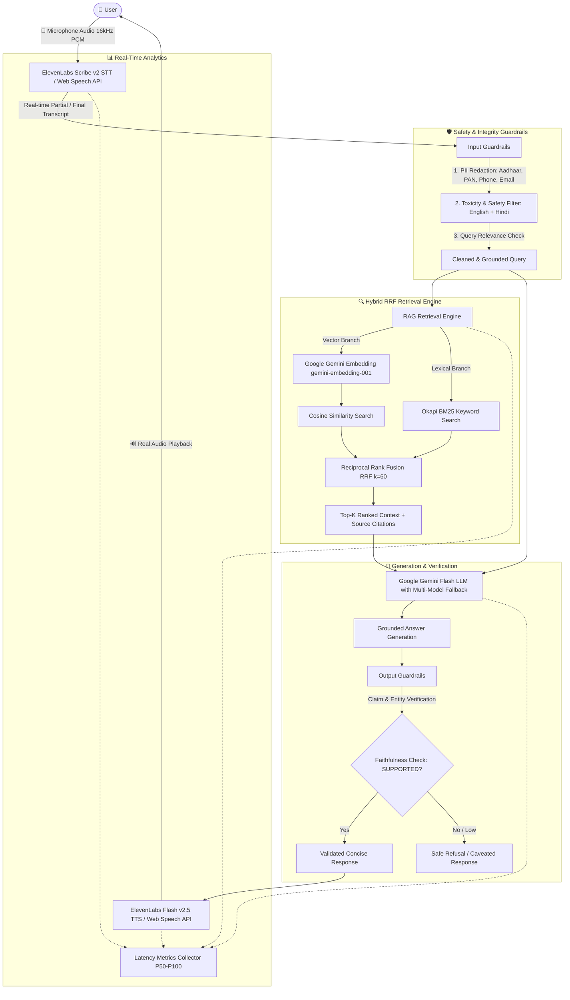

# 🔊 HHOGA Voice RAG — Multilingual Voice Assistant

A production-quality, real-time multilingual voice Retrieval-Augmented Generation (RAG) assistant built for **HH Goa 2026**.

The system enables natural, low-latency spoken conversations in **English**, **Hindi**, and **Hinglish**, grounded in verified knowledge base passages (MSMARCO-XI subset) with rigorous input/output guardrails, reciprocal rank fusion (RRF) hybrid retrieval, and genuine audio speech synthesis.

---

## 🏗️ Architecture



---

## 🚀 Key Features

### 1. Real End-to-End Voice Pipeline
* **Speech-to-Text (STT)**: 16kHz mono audio streaming to ElevenLabs Scribe v2 realtime WebSocket, with real-time interim partial transcripts and zero-latency Web Speech API fallback.
* **Text-to-Speech (TTS)**: ElevenLabs Flash v2.5 synthesis with real Web Audio API playback. Never uses synthetic `setTimeout` delays — UI reflects actual audio hardware state.
* **Full Cancellation**: Clicking stop immediately terminates microphone streams, closes WebSocket sessions, aborts pending RAG queries, and silences audio buffers.

### 2. Hybrid RAG with Reciprocal Rank Fusion (RRF)
* **Dense Semantic Search**: Google Gemini `gemini-embedding-001` (768-dim embeddings).
* **Sparse Lexical Search**: Native Okapi BM25 index ($k_1=1.5, b=0.75$) with bilingual tokenization.
* **Rank Fusion**: Reciprocal Rank Fusion ($RRF(d) = \sum \frac{1}{k + r_i}$ with $k=60$) overcoming raw score scale discrepancies.
* **Resilient Fallbacks**:
  * If embedding service fails $\rightarrow$ automatic **BM25-only fallback**.
  * If lexical search has 0 matches $\rightarrow$ automatic **semantic-only fallback**.
  * If both fail $\rightarrow$ graceful, helpful refusal.

### 3. Comprehensive Multilingual Guardrails
* **PII Redaction**: Detects & redacts Indian Aadhaar numbers, PAN cards, phone numbers (+91), email addresses, and credit cards before retrieval.
* **Toxicity Filter**: Deterministic bilingual blocklist (English & Hindi) with contextual allowlisting for educational queries.
* **Relevance Detection**: Structural validation preventing noise/gibberish hallucinations.
* **Faithfulness & Grounding**: Claim & entity verification distinguishing `SUPPORTED`, `PARTIALLY_SUPPORTED`, and `UNSUPPORTED` claims against retrieved passages.

### 4. Reliability & Structured Orchestration
* **Circuit Breaker**: 3-state circuit breaker (`CLOSED` $\rightarrow$ `OPEN` $\rightarrow$ `HALF_OPEN`) protecting external endpoints from cascade failures.
* **Exponential Backoff**: Jittered retries for transient 429 / 503 / network errors.
* **LRU Response Cache**: In-memory cache with normalized keys and TTL eviction for repeated queries.
* **Zod Schemas**: Strict I/O validation on all server functions and API responses.

### 5. High-Resolution Latency Observability
Measures genuine high-resolution millisecond timings:
* **STT Latency**: Time to first partial & final transcript.
* **Retrieval Latency**: Embedding generation + RRF fusion time.
* **LLM Generation**: TTFT and total completion duration.
* **TTS Latency**: Genuine time to first audio output.
* **Percentile Breakdown**: P50, P70, P90, P100 distribution across queries.

---

## 🛠️ Tech Stack

* **Frontend**: React 19, TypeScript, TanStack Start (SSR), TanStack Router, Vite
* **Styling**: Vanilla CSS Design System with Glassmorphism, CSS Custom Properties & CSS Grid
* **LLM & Embeddings**: Google Gemini API (`gemini-2.5-flash` / `gemini-2.0-flash` / `gemini-1.5-flash` fallback chain, `gemini-embedding-001`)
* **Voice STT & TTS**: ElevenLabs Scribe v2 WebSocket & Flash v2.5 / Web Speech API fallback
* **Validation**: Zod
* **Testing & Evaluation**: Vitest, tsx

---

## 📦 Getting Started

### Prerequisites
* Node.js $\ge 18.0.0$
* npm or pnpm

### Installation

```bash
# Clone the repository
git clone <repo-url>
cd hhgoa-voice-rag

# Install dependencies
npm install
```

### Environment Configuration

Create a `.env` file in the project root:

```bash
cp .env.example .env
```

Fill in your API keys in `.env`:

```env
# Server-Side Keys (Never exposed to browser)
GEMINI_API_KEY=your_google_gemini_api_key
ELEVENLABS_API_KEY=your_elevenlabs_api_key

# Client-Side Keys (For direct browser WebSocket STT/TTS)
VITE_ELEVENLABS_API_KEY=your_elevenlabs_publishable_key
VITE_ELEVENLABS_VOICE_ID=JBFqnCBsd6RMkjVDRZzb
```

*(Note: If `VITE_ELEVENLABS_API_KEY` is omitted, the app automatically runs using the browser's native Web Speech API for both STT and TTS!)*

---

## 🏃 Running the Application

### 1. Ingest Data (MSMARCO-XI Knowledge Base)
To index passages with the default `sentence_boundary` chunking strategy and generate Gemini embeddings:

```bash
npm run ingest
```

Options:
```bash
npx tsx scripts/ingest.ts --strategy sentence_boundary --limit 100
# Strategies available: sentence_boundary | fixed_overlap | paragraph | keyword_group | sliding_window | all
```

### 2. Start Development Server

```bash
npm run dev
```

Open [http://localhost:3000](http://localhost:3000) in your browser.

---

## 🧪 Testing & Evaluation

### Run Unit & Integration Tests

```bash
npm test
```

Runs comprehensive Vitest suites covering:
* Chunking algorithms and sentence boundary splitting (Hindi + English)
* Vector store cosine similarity, BM25, and RRF rank fusion
* PII redaction, toxicity filtering, relevance, and faithfulness
* Circuit breaker transitions, jittered retry, LRU cache eviction
* High-resolution latency tracking and percentiles

### Run Quantitative RAG Evaluation Benchmark

```bash
npm run evaluate
```

Evaluates the active pipeline against the bilingual ground-truth benchmark producing:
* **Retrieval**: Recall@1, Recall@3, Recall@5, Recall@10, MRR, NDCG@5
* **Generation**: Faithfulness rate, answer correctness, source citation precision
* **Latency**: Average STT, Retrieval, LLM TTFT, TTS, and End-to-End turnaround

---

## 📁 Repository Structure

```text
├── data/
│   └── embeddings.json          # Pre-indexed 768D vector records
├── scripts/
│   ├── ingest.ts                # Ingestion & chunking pipeline
│   └── evaluate.ts              # Quantitative RAG evaluation runner
├── src/
│   ├── components/
│   │   ├── AudioPlayer.tsx      # Real TTS audio playback indicator & controls
│   │   ├── GuardrailsPanel.tsx  # Pass/fail badges for safety & PII checks
│   │   ├── LatencyDashboard.tsx # P50-P100 latency analytics & stage breakdown
│   │   ├── Transcript.tsx       # Live STT interim bubbles & source cards
│   │   └── VoiceRecorder.tsx    # FFT waveform visualizer & push-to-talk mic
│   ├── lib/
│   │   ├── chunking.ts          # 5 chunking strategies + language detection
│   │   ├── evaluation.ts        # Recall, MRR, NDCG & correctness metrics
│   │   ├── guardrails.ts        # PII, Toxicity, Relevance, & Faithfulness checks
│   │   ├── harness.ts           # Circuit breaker, Retry, LRU cache, Zod schemas
│   │   ├── metrics.ts           # Metrics collector & percentile calculation
│   │   ├── server-functions.ts  # TanStack Start SSR RAG server endpoint
│   │   ├── stt-client.ts        # ElevenLabs Scribe v2 + Web Speech API STT
│   │   ├── tts-client.ts        # ElevenLabs Flash v2.5 + Web Speech API TTS
│   │   ├── vector-store.ts      # In-memory Vector Store + Okapi BM25 + RRF
│   │   └── voice-pipeline.ts    # End-to-end voice coordinator & cancel logic
│   ├── routes/
│   │   ├── __root.tsx           # Document layout & meta headers
│   │   ├── api.rag.stream.ts    # SSE streaming RAG query endpoint
│   │   ├── api.voice.token.ts   # ElevenLabs token proxy endpoint
│   │   └── index.tsx            # Main voice RAG dashboard interface
│   ├── router.tsx               # TanStack Router configuration
│   └── styles.css               # Design system & tokens
├── tests/
│   ├── chunking.test.ts
│   ├── guardrails.test.ts
│   ├── harness.test.ts
│   ├── metrics.test.ts
│   └── vector-store.test.ts
├── vitest.config.ts
└── package.json
```

---

## 🔒 Security & Guardrails Summary

1. **No Client Key Leakage**: The Google Gemini API key is strictly maintained on the server within TanStack Start server functions (`processRAGQuery`).
2. **Indian PII Protection**: Regex pattern matching sanitizes Aadhaar, PAN, phone numbers, and payment cards prior to vector retrieval or LLM inference.
3. **Deterministic Safety Filter**: Harmful and violent queries in English and Hindi are blocked at step 1 before incurring LLM/retrieval costs.
4. **Factual Grounding**: Output responses are verified against retrieved passage tokens and numerical entities to prevent ungrounded hallucinations.

---

## 📈 Known Limitations & Future Enhancements

* **Web Speech Fallback**: On browsers without Web Speech API (e.g. Firefox desktop without flag enabled), setting `VITE_ELEVENLABS_API_KEY` is recommended for full voice functionality.
* **Reranking**: Future iterations can integrate cross-encoder rerankers (e.g., BGE-Reranker or Cohere) on top of RRF candidates.
* **AudioWorklet**: Upgrading the microphone capture from `ScriptProcessorNode` to modern `AudioWorkletNode` for lower-latency off-main-thread audio processing.
